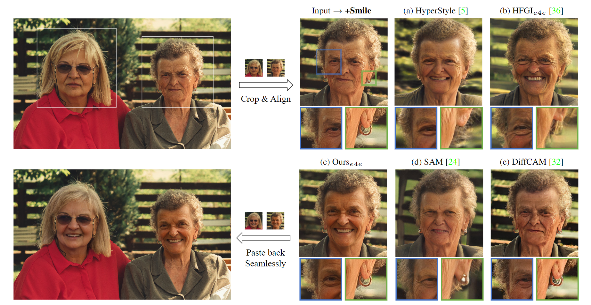

# Out-of-domain GAN inversion via Invertibility Decomposition
Official implementation of 'Out-of-domain GAN inversion via Invertibility Decomposition for Photo-Realistic Human Face Manipulation'

<a href='https://arxiv.org/abs/2212.09262'></a> 

<div align=center>
  
  
Out-of-domain GAN inversion and attribute manipulation. 
</div>

## 🎏 Abstract

In this paper, we propose a novel framework that enhances the fidelity of human face inversion by designing a new module to decompose the input images to ID and OOD partitions with invertibility masks.

<details><summary>CLICK for the full abstract</summary>
  
> The fidelity of Generative Adversarial Networks (GAN) inversion is impeded by Out-Of-Domain (OOD) areas (e.g., background, accessories) in the image. Detecting the OOD areas beyond the generation ability of the pre-trained model and blending these regions with the input image can enhance fidelity. The ``invertibility mask" figures out these OOD areas, and existing methods predict the mask with the reconstruction error. However, the estimated mask is usually inaccurate due to the influence of the reconstruction error in the In-Domain (ID) area. In this paper, we propose a novel framework that enhances the fidelity of human face inversion by designing a new module to decompose the input images to ID and OOD partitions with invertibility masks. Unlike previous works, our invertibility detector is simultaneously learned with a spatial alignment module. We iteratively align the generated features to the input geometry and reduce the reconstruction error in the ID regions. Thus, the OOD areas are more distinguishable and can be precisely predicted. Then, we improve the fidelity of our results by blending the OOD areas from the input image with the ID GAN inversion results. Our method produces photo-realistic results for real-world human face image inversion and manipulation. Extensive experiments demonstrate our method's superiority over existing methods in the quality of GAN inversion and attribute manipulation.

</details>

## 🚧 Todo

- [ ] Release the training and inference codes
- [ ] Release the guidance documents for manipulation
Coming soon!

## 📍 Citation 

```
@misc{yang2022photorealistic,
      title={Photo-Realistic Out-of-domain GAN inversion via Invertibility Decomposition}, 
      author={Xin Yang and Xiaogang Xu and Yingcong Chen},
      year={2022},
      eprint={2212.09262},
      archivePrefix={arXiv},
      primaryClass={cs.CV}
}
```
